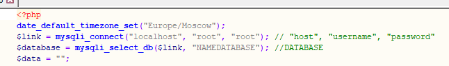
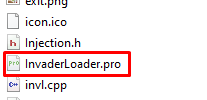
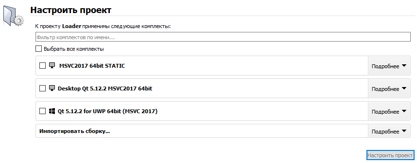
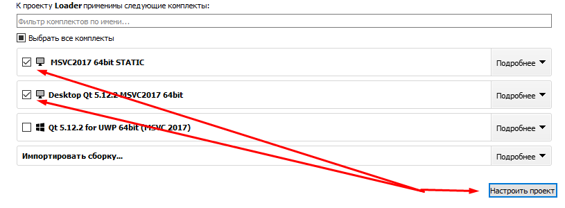
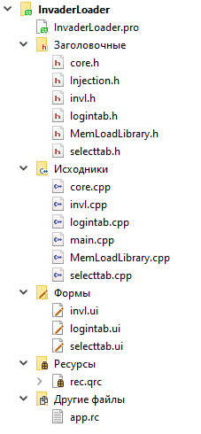
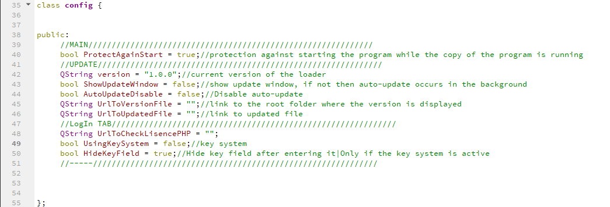
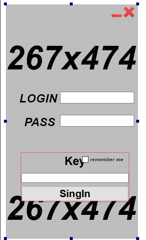
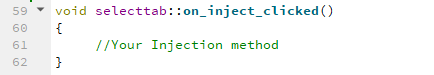

### Loader by Letomaniy
## [In english](#en)
## [На русском](#ru)

# RU    
## Invader Loader информация

:white_check_mark: Данный лоадер изготавливался конкретному человеку. Но т.к. он ему уже по сути не нужен выложу его сюда. Он из себя представляет лоадер написаный на QT C++ с некоторыми методами на winapi. В нём есть автообновление авторизация по логин/пароль(по желанию можно включить дополнительное подтверждение по ключю), метод для распаковки ресурсов, метод для работы с неуправляемыми библиотеками из байтового массива и метод иньекции dll в процесс. Самое пожалуй главное это привязка аккаунта по HWID. 

## Как использовать?
1. Нужно выполнить все пункты по этой ссылке (https://github.com/Letomaniy/QT-Static-Build-MSCV-5.9-5.15), для того чтоб была возможность собирать проект в статическом варианте.
1.1 После выполненного первого пункта, загружаем весь ServerSide на хостинг(сайт без SSL сертификата).
1.2 Импортируем .sql файл в базу данных
1.3 Подключаем check.php скрипт к базе данных указав в 3,4 строках данные от БД.



2. Запустим исходный код в программе QT Creator. Для этого нужно запустить .pro файл который находится в папке с исходным кодом



2.1 После запуска .pro файла можно настроить проект. У меня имеются три комплекта, я выберу комплект для отладки(Debug) проекта и для финального варианта(static). Как у вас будут названы эти комплекты и будут ли они вообще я не знаю. Но по инструкции и первого пункта вы должны получить как минимум комплект для статической линковки.




2.2 После настройки проекта у вас в обозревателе получится что-то вроде того что на следующем скриншоте. Объясню что за что отвечает:



InvaderLoader - корневая папка проекта
InvaderLoader.pro - файл проекта, в этом файле хранятся первоначальные настройки для QT Creator и для Qmake
- Заголовочные(Headers) - заголовочные файлы C++
- Исходники(Sources) - исходные файлы C++
- Формы(Forms) - файлы графических форм вашего приложения
- Ресурсы(Resouces) - тут находится файл ресурсов где можно хранить картинки и dll которые нужно будет внедрить
- Другие файлы(Others file) - папка для прочих файлов которые могут понадобится в проекте(не является аналогом ресурсов)

3.  Настраиваем лоадер в заголовочных и исходных файлах кода C++:
3.1 Для начала заходим в файл core.h, как можно понять он является своеобразным ядром. Тут находится большая часть настроек которые нужно указать.



В классе config который инициализируется почти в каждой части лоадера находятся основные настройки которые подписаны как в самом редакторе кода, так и здесь я их опишу.
`bool ProtectAgainStart` - разрешает/запрещает(false/true) повторный запуск лоадера, если программа уже была запущена ранее и работает сейчас.
`QString version` - строковое значение которое указывает версию лоадера(требуется для автообновления)
`bool ShowUpdateWindow` - показывает/не показывает(true/false) окно которое уведомляет о проверки и последующем обновлении лоадера
`bool AutoUpdateDisable` - включает/выключает(false/true) автообновление лоадера. Подходит для тех людей которые любят скидывать билды вручную
`QString UrlToVersionFile` - строковое значение в которое требуется вписать ссылку на version.txt файл который размещён у вас на сайте(если отключено автообновление, то можно оставить пустым)
`QString UrlToUpdatedFile` - строковое значение в которое требуется вписать ссылку на файл обновлённого лоадера который размещён у вас на сайте(если отключено автообновление, то можно оставить пустым)
`QString UrlToCheckLisencePHP`- строковое значени в которое требуется вписать ссылку на основной файл обработки запроса check.php который размещён у вас на сайте
`bool UsingKeySystem` - система ключей, на ваше усмотрение если вы знаете что с ней можно будет интересного придумать(допустим выдавать только ключ, а человек будет вводить логин/пароль по желанию)
`bool HideKeyField` - скрывает область которая обведена красным прямоугольником




АВТООБНОВЛЕНИЕ РАБОТАЕТ СЛЕДУЮЩИМ ОБРАЗОМ: 
1) Создаём билд с версией выше чем была прежде. 
2) Загружаем билд на сайт
3) Указываем новую версию в файле version.txt который размещён у вас на сайте.
4) При запуске лоадера с устаревшей версией(версия указывается в строковом значении `QString version`)

Теперь разберёмся как использовать этот лоадер после всех настроек(при условии что все интернет запросы работают правильно)

4. Нам нужно будет написать собственный метод для иньекции dll в целевой процесс:
1) Нужно будет найти в файле selecttab.cpp обработчик нажатия на кнопку Inject название обработчика `on_inject_clicked`
2) Внутри обработчика ничего нет, по этому мы должны сделать это сами(по этому там и написано "Your Injection method"):



3) Чтоб сделать самую простую загрузку неуправляемой DLL в целевой процесс нужно подсмотреть что там есть в ядре проекта (core.h), а есть там вот такой интересный код:
```c++
QString MD5Hash(QString file);
void ShowMessageBox(HWND hhh, QString Text, QString Title, int nButtons = MB_OK | MB_ICONERROR);
bool ProcessIsRun(QString processname);
bool WindowSearchW(QString windowname);
bool WindowSearch(const char * str);
bool WindowSearchС(QString _classname);
QString Request(RequestMethod requestMethod, QString url, QStringList value);
QString GETRequest(QString url);
QString GetRandomString();
QString POSTRequest(QString url, QStringList key, QStringList value);
QString stringEncrypt(QString strInput, QString strPassword);
QString stringDecrypt(QString strInput, QString strPassword);
HWND findwind(const char * str);
void resource_extract(QString resource_way , QString savefile);
DWORD FindProcessId(QString processName);
bool InjectDll(QString _pName, QString _dllPath);
std::string string_to_hex(const std::string& in);
void encryptionFunc(std::string& nString, DWORD key);
```
Из всего этого кода нам нужно только пара функций. А именно ProcessIsRun, ShowMessageBox, resource_extract и InjectDll. 
Сейчас покажу как этим пользоваться на примере кода. Нам нужно произвести иньекцию в процесс под именем Example.exe, внедрять будет dll которая написана на C++(примера dll не будет)
Сперва мы засунем в ресурсы проекта нужную DLL, и нам нужно будет потом её достать, для этого нам нужен метод resource_extract:
```c++
core::resource_extract(":/example.dll", "Example.dll");
```
Потом мы пропишем действие для проверки запущен ли процесс Example.exe с помощью ProcessIsRun:
```c++
core::ProcessIsRun("Example.exe");
```
Когда дам вернуло true мы можем производить иньекцию с помощью метода InjectDll:
```c++
core::InjectDll("Example.exe", "Example.dll");
```
После получения true мы можем вызвать сообщение о успешной иньекции:
```c++
core::ShowMessageBox(NULL, "Injection complete!", "sosi bebry");
```
Выглядит весь код примерно так:
```c++
    core::resource_extract(":/example.dll", "Example.dll");
    if(core::ProcessIsRun("Example.exe"))
    {
        if(core::InjectDll("Example.exe", "Example.dll"))
        {
            core::ShowMessageBox(NULL, "Injection complete!", "sosi bebry");
        }
    }
```
Надеюсь всё понятно! Если не понятно то вкладка Issue всегда доступна для вопросов и обсуждения!

# EN
## Invader Loader info

:white_check_mark: This loader was made by a specific person. But since he doesn't really need it anymore. I'll post it here. It is a loader written in QT C ++ with some functions on winapi. It has auto-renewal of authorization by key (if you wish, you can enable additional confirmation by key), a method for unpacking resources, a method for working with unmanaged libraries from a byte array, and a method for injecting dll into a process. Perhaps the most important thing is linking an account by HWID.

## How to use?
1. You need to complete all the points on this link (https://github.com/Letomaniy/QT-Static-Build-MSCV-5.9-5.15) in order to be able to build the project in a static version.
1.1 After completing the first step, upload the entire ServerSide to the hosting (site without SSL certificate).
1.2 Importing the .sql file into the database
1.3 We connect the check.php script to the database by specifying the data from the database in 3,4 lines.


2. Let's run the source code in the QT Creator program. To do this, you need to run the .pro file which is located in the folder with the source code


2.1 After running the .pro file, you can set up the project. I have three kits, I will choose a kit for debugging (Debug) the project and for the final version (static). How you will name these kits and whether they will be at all, I do not know. But according to the instructions and the first point, you should receive at least a kit for static linking.


2.2 After setting up the project, you will have something like the following screenshot in your browser. I will explain what he is responsible for:


InvaderLoader - project root folder
InvaderLoader.pro - project file, this file stores the initial settings for QT Creator and for Qmake
- Headers - C ++ header files
- Sources - C ++ source files
- Forms - files of graphic forms of your application
- Resources- there is a resource file where you can store pictures and dlls that will need to be embedded
- Other files- a folder for other files that may be needed in the project (not analogous to resources)

3. Configure the loader in the header and source files of the C ++ code:
3.1 First, go to the core.h file, as you can understand it is a kind of core. This is where most of the settings you need to specify are located.


In the config class, which is initialized in almost every part of the loader, there are basic settings that are signed both in the code editor itself, and here I will describe them.
`bool ProtectAgainStart` - enables / disables (false / true) the repeated launch of the loader, if the program has already been launched and is running now.
`QString version` - a string value that indicates the version of the loader (required for auto-update)
`bool ShowUpdateWindow` - shows / does not show (true / false) a window that notifies about checking and subsequent updating of the loader
`bool AutoUpdateDisable` - enables / disables (false / true) auto-update of the loader. Suitable for people who like to manually fold builds
`QString UrlToVersionFile` - a string value into which you want to enter a link to the version.txt file that is posted on your site (if auto-update is disabled, you can leave it blank)
`QString UrlToUpdatedFile` - a string value into which you need to enter a link to the updated loader file that is posted on your site (if auto-update is disabled, you can leave it blank)
`QString UrlToCheckLisencePHP` - string value in which you need to enter a link to the main file for processing the request check.php that is posted on your website
`bool UsingKeySystem` - a system of keys, at your discretion if you know what you can think of interesting things with it (let's only give out the key, and the person will enter the login / password at will)
`bool HideKeyField` - hides the area surrounded by a red rectangle


AUTO UPDATE WORKS AS FOLLOWS:
1) We create a build with a version higher than it was before.
2) Uploading the build to the site
3) Specify the new version in the version.txt file that is posted on your website.
4) When starting a loader with an outdated version (the version is indicated in the string value `QString version`)

Now let's figure out how to use this loader after all the settings (provided that all Internet requests are working correctly)

4. We will need to write our own method for injecting dlls into the target process:
1) You will need to find the handler for clicking the Inject button in the selecttab.cpp file and the name of the handler `on_inject_clicked`
2) There is nothing inside the handler, so we have to do it ourselves (that's why "Your Injection method" is written there):


3) To make the simplest loading of an unmanaged DLL into the target process, you need to spy on what is there in the core of the project (core.h), but there is such an interesting code there:
```c++
QString MD5Hash(QString file);
void ShowMessageBox(HWND hhh, QString Text, QString Title, int nButtons = MB_OK | MB_ICONERROR);
bool ProcessIsRun(QString processname);
bool WindowSearchW(QString windowname);
bool WindowSearch(const char * str);
bool WindowSearchС(QString _classname);
QString Request(RequestMethod requestMethod, QString url, QStringList value);
QString GETRequest(QString url);
QString GetRandomString();
QString POSTRequest(QString url, QStringList key, QStringList value);
QString stringEncrypt(QString strInput, QString strPassword);
QString stringDecrypt(QString strInput, QString strPassword);
HWND findwind(const char * str);
void resource_extract(QString resource_way , QString savefile);
DWORD FindProcessId(QString processName);
bool InjectDll(QString _pName, QString _dllPath);
std::string string_to_hex(const std::string& in);
void encryptionFunc(std::string& nString, DWORD key);
```
From all this code, we only need a couple of functions. Namely ProcessIsRun, ShowMessageBox, resource_extract and InjectDll.
Now I will show you how to use it using a code example. We need to inject into the process under the name Example.exe, the dll which is written in C ++ will be injected (there will be no example dll)
First, we will shove the required DLL into the project resources, and then we will need to get it, for this we need the resource_extract method:
```c++
core::resource_extract(":/example.dll", "Example.dll");
```
Then we will write an action to check if the Example.exe process is running using ProcessIsRun:
```c++
core::ProcessIsRun("Example.exe");
```
When I return true, we can inject using the InjectDll method:
```c++
core::InjectDll("Example.exe", "Example.dll");
```
After receiving true, we can call a message about successful injection:
```c++
core::ShowMessageBox(NULL, "Injection complete!", "sosi bebry");
```
The whole code looks like this:
```c++
    core::resource_extract(":/example.dll", "Example.dll");
    if(core::ProcessIsRun("Example.exe"))
    {
        if(core::InjectDll("Example.exe", "Example.dll"))
        {
            core::ShowMessageBox(NULL, "Injection complete!", "sosi bebry");
        }
    }
```
I hope everything is clear! If it's not clear then the Issue tab is always available for questions and discussion!
